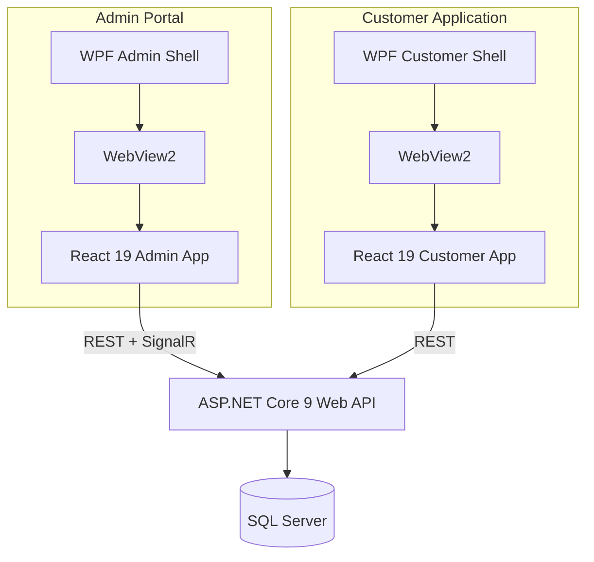
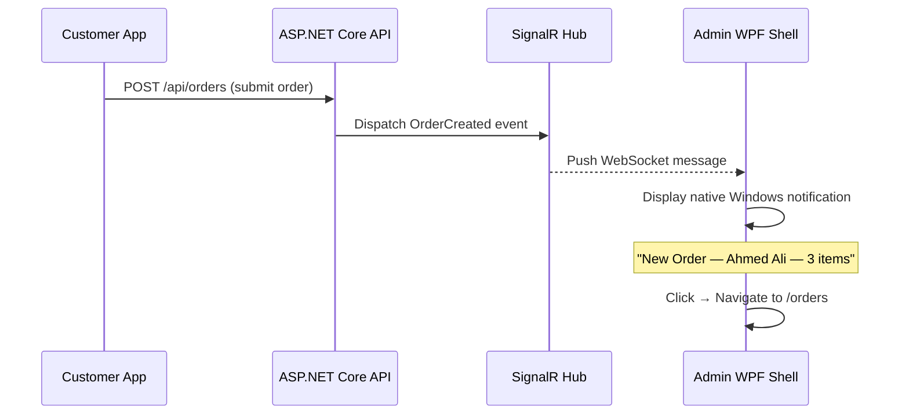
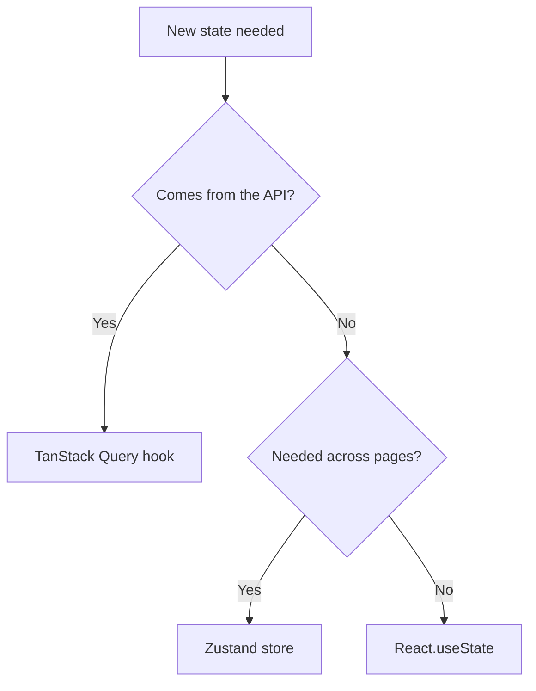
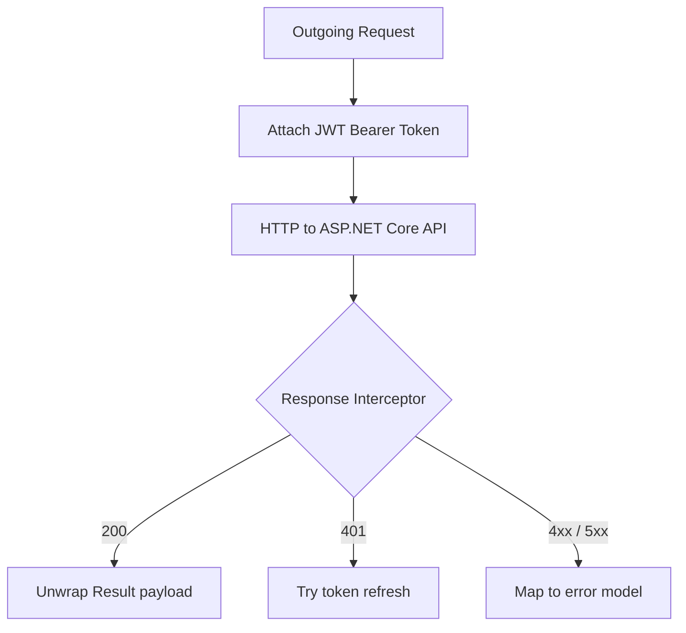
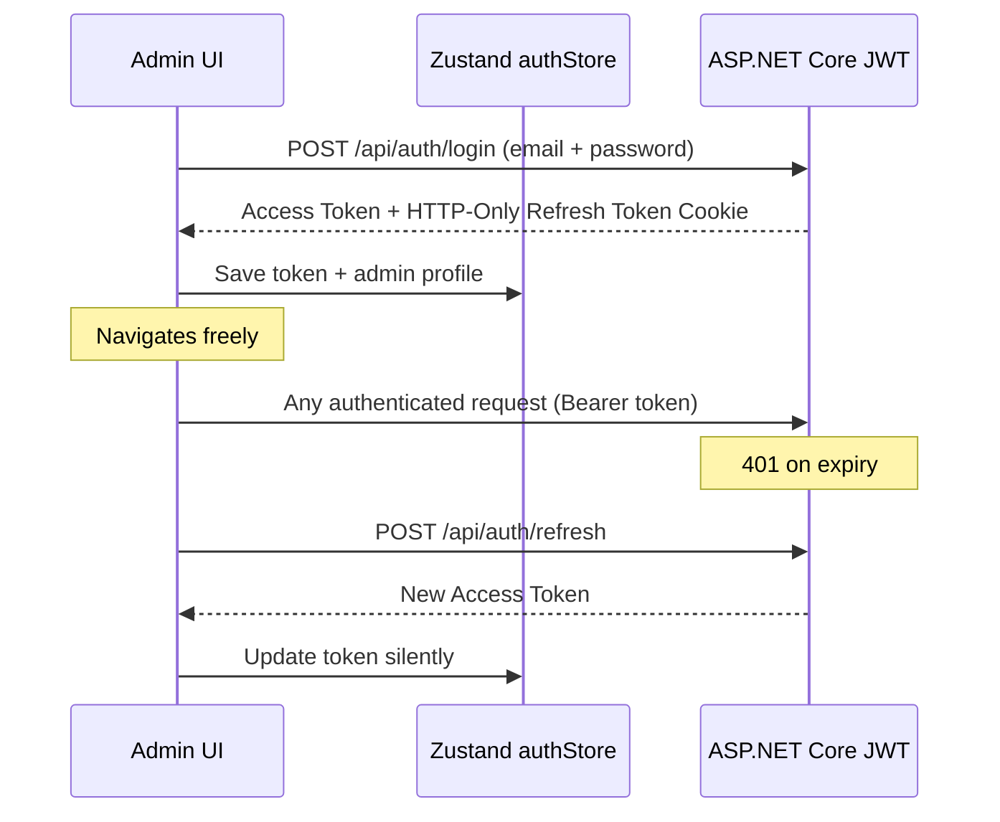
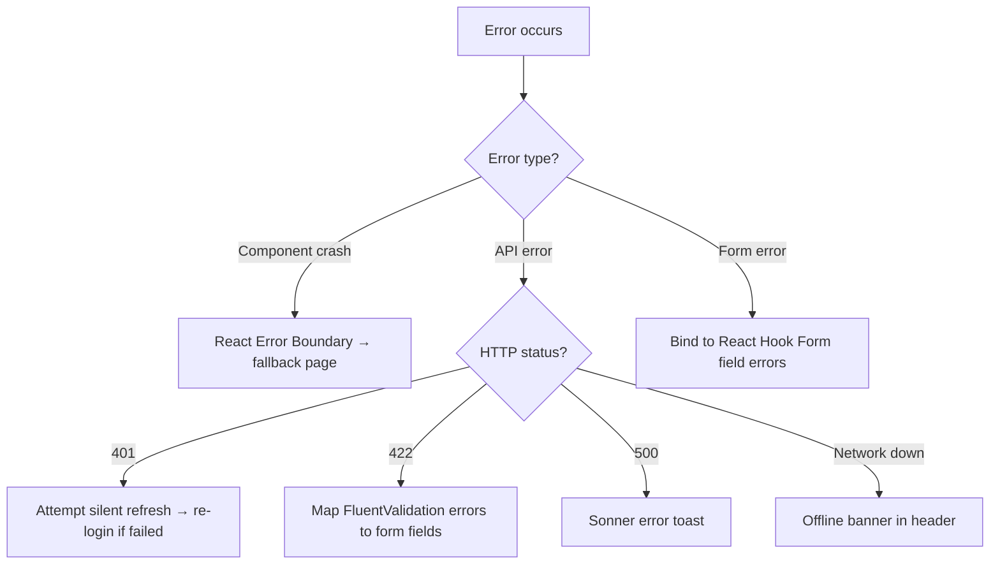

# Smart Device Manager (SDM) - Frontend Architecture Document
**Version:** 1.0
**Status:** Updated — Dual-Portal Architecture
**Target Platform:** React 19 inside WPF + WebView2 (Admin Portal & Customer Application)

---

## 1. Frontend Vision

The SDM frontend consists of two independent React applications sharing a common component library, API client, and design system.

- **Admin Portal** — enterprise admin console for managing software, orders, knowledge base content, device monitoring, users, and company settings.
- **Customer Application** — a focused, accessible application for customers to monitor their device, run diagnostics, install software, and place orders.

Both applications run inside WPF desktop shells via WebView2 (Edge Chromium) and share:
- A common HTTP client (`packages/api-client/httpClient.ts`)
- A shared UI component library (`packages/ui`)
- The same design token system (Tailwind CSS v4)
- The same shadcn/ui component library



---

## 2. Design Philosophy

| Principle | Description |
| :--- | :--- |
| **Separation of Concerns** | UI components render props only. Logic lives in custom hooks. |
| **KISS** | No premature abstractions. Generalizations made only when a pattern repeats 3+ times. |
| **SOLID** | Single responsibility per component. Open for extension via props composition. |
| **Type-Safe by Default** | Strict TypeScript mode. Zod validates API boundaries at runtime. |
| **Declarative UI** | State-driven rendering. React 19 transitions handle async flows declaratively. |
| **DRY via Shared Components** | All shared UI (DeviceHardwarePanel, CpuCard, SoftwareCard, etc.) is defined once in `packages/ui` and imported by both portals. Duplication is forbidden. |

---

## 3. Monorepo Folder Structure

Both applications live in the same repository under separate `apps/` directories, sharing a `packages/` layer for cross-portal code.

```text
sdm-frontend/
├── apps/
│   ├── admin/                    # Admin Portal React application
│   │   ├── src/
│   │   │   ├── features/
│   │   │   │   ├── dashboard/
│   │   │   │   ├── orders/
│   │   │   │   ├── software/
│   │   │   │   ├── knowledge-base/
│   │   │   │   ├── device-monitor/
│   │   │   │   ├── users/
│   │   │   │   ├── company/
│   │   │   │   └── settings/
│   │   │   ├── layouts/
│   │   │   ├── routes/
│   │   │   ├── App.tsx
│   │   │   └── main.tsx
│   │   └── vite.config.ts
│   │
│   └── customer/                 # Customer Application React application
       ├── src/
       │   ├── features/
       │   │   ├── onboarding/      # First-launch customer profile form (local storage only)
       │   │   ├── dashboard/
       │   │   ├── device-details/
       │   │   ├── device-check/
       │   │   ├── software-center/
       │   │   ├── knowledge-base/
       │   │   ├── orders/
       │   │   └── company/
       │   ├── layouts/
       │   ├── routes/
       │   ├── App.tsx
       │   └── main.tsx
       └── vite.config.ts
│
└── packages/
    ├── ui/                       # Shared shadcn/ui components + design tokens
    │   ├── components/
    │   │   ├── ui/               # shadcn/ui primitives
    │   │   ├── DeviceHardwarePanel.tsx  # <<< SHARED — Admin Device Monitor + Customer Device Details
    │   │   ├── CpuCard.tsx              # Sub-panel used inside DeviceHardwarePanel
    │   │   ├── GpuCard.tsx              # Sub-panel used inside DeviceHardwarePanel
    │   │   ├── MemoryCard.tsx           # Sub-panel used inside DeviceHardwarePanel
    │   │   ├── DiskCard.tsx             # Sub-panel used inside DeviceHardwarePanel
    │   │   ├── TemperatureCard.tsx      # Sub-panel used inside DeviceHardwarePanel
    │   │   ├── NetworkCard.tsx          # Sub-panel used inside DeviceHardwarePanel
    │   │   ├── DisplayCard.tsx          # Sub-panel used inside DeviceHardwarePanel
    │   │   ├── StorageCard.tsx          # Sub-panel used inside DeviceHardwarePanel
    │   │   ├── SoftwareCard.tsx         # <<< SHARED — Customer Software Center
    │   │   ├── CompanyInfoCard.tsx      # <<< SHARED — Customer Company Information
    │   │   ├── DataTable.tsx
    │   │   ├── StatusBadge.tsx
    │   │   └── ConfirmDialog.tsx
    │   └── index.ts
    ├── api-client/               # Axios instance, interceptors, response normalizer
    │   ├── httpClient.ts
    │   └── index.ts
    ├── hooks/                    # Shared cross-portal hooks
    └── types/                    # Shared TypeScript interfaces
```

---

## 4. Feature Module Structure

Each feature inside `apps/admin/src/features/` or `apps/customer/src/features/` follows the same internal shape:

```text
features/[module-name]/
├── api/
│   ├── useGet[Entity].ts         # TanStack Query read hooks
│   └── useMutate[Entity].ts      # TanStack Query write hooks + cache invalidation
├── components/
│   ├── [Entity]Form.tsx          # React Hook Form + Zod validated form
│   ├── [Entity]Table.tsx         # TanStack Table wrapper
│   └── [Entity]Card.tsx          # Summary card component
├── hooks/                        # Internal business logic hooks
├── types/
│   └── index.ts                  # TypeScript interfaces and Zod schemas
└── index.ts                      # Public API — only export from here
```

**Module boundary rule:** Features never import internal files from sibling features. Cross-feature communication uses the `index.ts` public API only.

---

## 5. Admin Portal — Page Map

| Page | Route | Purpose |
| :--- | :--- | :--- |
| Login | `/login` | Admin authentication |
| Dashboard | `/dashboard` | Stats, recent orders, system status, quick actions |
| Orders Management | `/orders` | Manage catalog target products and incoming customer orders |
| Software Management | `/software` | Manage apps and drivers in a unified list |
| Knowledge Base Management | `/knowledge-base` | Create and manage troubleshooting articles |
| Device Monitor | `/devices` | View device hardware using `DeviceHardwarePanel` |
| Users | `/users` | Manage administrator accounts |
| Company Information | `/company` | Edit company profile shown to customers |
| Settings | `/settings` | Application preferences |

---

## 6. Customer Application — Page Map

| Page | Route | Purpose |
| :--- | :--- | :--- |
| Dashboard | `/` | PC health summary, quick actions |
| Device Details | `/device` | Full hardware info via `DeviceHardwarePanel` |
| Device Check | `/device-check` | Full diagnostic scan + recommendations |
| Software Center | `/software` | Browse and install/update admin-uploaded software |
| Knowledge Base | `/knowledge-base` | Browse troubleshooting articles |
| Orders | `/orders` | Browse products, add to cart, checkout |
| Company Information | `/company` | View company contact info |

---

## 7. Shared Component: DeviceHardwarePanel

`DeviceHardwarePanel` is THE single most important shared component in the system.

It is defined in `packages/ui/components/DeviceHardwarePanel.tsx` and imported by both portals.

It displays:

| Section | Fields |
| :--- | :--- |
| **CPU** | Generation, Cores, Threads, Clock Speed, Temperature, Usage |
| **GPU** | Name, VRAM, Temperature, Usage, Driver Version |
| **RAM** | Total, Used, Free, Usage % |
| **Storage** | Per disk: Name, Type, Health, Temperature, Total, Used, Free. Per partition: Usage |
| **Displays** | Monitor Name, Resolution, Refresh Rate (multi-monitor) |
| **Network** | IP, MAC, Upload speed, Download speed |
| **Motherboard** | Model, Manufacturer |
| **BIOS** | Version, Date |
| **Windows** | Version, Build, Activation Status |
| **Drivers** | Installed driver list with version numbers |

**Rule:** This component and all its sub-panels (`CpuCard`, `GpuCard`, `MemoryCard`, `DiskCard`, `TemperatureCard`, `NetworkCard`, `DisplayCard`, `StorageCard`) must never be duplicated or re-implemented per portal. All sub-panels live in `packages/ui/components/`. Any change to any component propagates to both portals automatically.

The visual layout is identical in both portals. Only the available admin actions differ (e.g., admin may see additional controls; customer sees the same UI without those controls).

---

## 8. Routing Architecture

Both portals use **React Router v7** with Data API routing (loaders/actions).

### Admin Portal Router
```text
/login              → AuthLayout → LoginPage
/dashboard          → AdminLayout → DashboardPage
/orders             → AdminLayout → OrdersPage
/orders/:id         → AdminLayout → OrderDetailDrawer
/software           → AdminLayout → SoftwarePage
/knowledge-base     → AdminLayout → KnowledgeBasePage
/devices            → AdminLayout → DeviceMonitorPage
/users              → AdminLayout → UsersPage
/company            → AdminLayout → CompanyPage
/settings           → AdminLayout → SettingsPage
```

### Customer Application Router
```text
/onboarding         → OnboardingLayout → OnboardingPage  (first launch only)
/                   → CustomerLayout → DashboardPage
/device             → CustomerLayout → DeviceDetailsPage
/device-check       → CustomerLayout → DeviceCheckPage
/software           → CustomerLayout → SoftwareCenterPage
/knowledge-base     → CustomerLayout → KnowledgeBasePage
/orders             → CustomerLayout → OrdersPage
/company            → CustomerLayout → CompanyPage
```

All routes are lazy-loaded (`React.lazy`) to keep initial bundle size under 200kb.

---

## 9. Layout Architecture

### Admin Portal Layouts
- **AuthLayout:** Centered card for login. No sidebar.
- **AdminLayout:** Left collapsible sidebar + fixed top header + scrollable content area.

### Customer Application Layouts
- **OnboardingLayout:** Full-screen centered form shown only on first launch to collect customer profile.
- **CustomerLayout:** Compact left sidebar + top bar + scrollable content area. Desktop-first layout following standard Windows application conventions.

---

## 10. SignalR Integration (Admin Portal Only)

SignalR is used exclusively for order notifications in the Admin Portal.



The Zustand store listens to the SignalR connection and updates the orders badge count in the sidebar automatically. There is no standalone Notifications page.

---

## 11. State Management Strategy



### Zustand Store Domains

| Store | Portal | Contents |
| :--- | :--- | :--- |
| `authStore` | Admin | JWT token, admin profile, role |
| `layoutStore` | Admin | Sidebar collapsed state, active theme |
| `notificationStore` | Admin | Unread order count from SignalR |
| `customerProfileStore` | Customer | Locally stored name, phone, WhatsApp, governorate, address |
| `deviceStore` | Customer | Cached local hardware scan data |
| `cartStore` | Customer | Shopping cart items |

---

## 12. API Layer Architecture

A single Axios instance is shared across both portals via `packages/api-client/httpClient.ts`.



- Admin Portal requests include the JWT `Authorization` header.
- Customer Application requests are unauthenticated. The customer profile (name, phone, address) is stored locally and sent as order payload data — not as a session or token.

---

## 13. Authentication Flow (Admin Portal Only)



The Customer Application does not use authentication. On first launch, the `OnboardingPage` collects customer profile information (name, phone, WhatsApp, governorate, address) and stores it locally via `customerProfileStore`. No username, no password, no tokens.

---

## 14. Software Management Architecture

The Software Management page in the Admin Portal replaces the former separate Drivers and Software Packages pages.

All software entries — applications and drivers — live in a single unified table.

| Field | Description |
| :--- | :--- |
| Name | Display name |
| Category | `Application` or `Driver` |
| Version | Extracted automatically from the setup file when possible |
| Description | Short admin-authored description |
| Icon | Uploaded image |
| Setup File | The installer binary |
| Upload Date | Auto-set on creation |
| Updated Date | Auto-set on file replacement |

### Admin Actions
- **Add New Software:** Create a full entry with name, category, description, icon, and setup file.
- **Update Existing Software:** Upload a newer setup file only. Name, category, description, and icon are preserved. Version and Updated Date are updated automatically.
- **Edit:** Change name, description, category, or icon only (not the setup file).
- **Delete:** Remove the entry entirely.

### Version Detection
The backend analyzes setup file metadata on upload and extracts a version string automatically. If extraction fails, the admin can enter it manually.

### No Silent Install Configuration
The admin never sets up silent flags, detection rules, or deployment scripts. Customers run the standard setup UI.

---

## 15. Knowledge Base Architecture

Knowledge base articles are a simple CMS controlled by the admin and displayed in the Customer Application.

| Field | Admin Input | Customer View |
| :--- | :--- | :--- |
| Problem Name | Required text | Article title |
| Description | Required rich text | Article body |
| Problem Image | Optional upload | Hero image |
| YouTube Video URL | Optional URL | Large YouTube button |
| Category | Required select | Filter group |
| Display Order | Integer | Sort position |
| Visible | Toggle | Hides/shows article |

---

## 16. Naming Conventions

| Target | Pattern | Example |
| :--- | :--- | :--- |
| Variables | `camelCase` | `isOnline`, `orderCount` |
| React Hooks | `use` + `PascalCase` | `useOrderList`, `useDeviceScan` |
| TypeScript Interfaces | `PascalCase` | `IOrder`, `ISoftwareItem` |
| Zod Schemas | Suffix with `Schema` | `orderSchema`, `softwareSchema` |
| Constants | `UPPER_SNAKE_CASE` | `MAX_FILE_SIZE_MB` |
| Components | `PascalCase.tsx` | `SoftwareTable.tsx`, `OrderCard.tsx` |
| Hooks files | `camelCase.ts` | `useOrders.ts`, `useSoftware.ts` |
| Utilities | `camelCase.ts` | `formatDate.ts`, `parseVersion.ts` |
| Assets | `kebab-case` | `sdm-logo.svg`, `no-orders.svg` |

---

## 17. TypeScript Standards

- Strict mode enabled. No implicit `any`.
- API responses are validated with Zod schemas at the boundary.
- Use `interface` for component props and API contracts.
- Use `type` for unions, discriminated unions, and aliases.

---

## 18. Performance Strategy

| Strategy | Application | Mechanism |
| :--- | :--- | :--- |
| Route-level code splitting | Both | `React.lazy` + `Suspense` |
| Table row virtualization | Admin | TanStack Virtual for 200+ row lists |
| API response caching | Both | TanStack Query stale-time configuration |
| Optimistic updates | Admin | Mutation hooks update cache before server confirms |
| Bundle splitting | Both | Vite manual chunks for heavy vendors (recharts, radix) |

---

## 19. Error Handling Strategy



---

## 20. Accessibility Standards

- WCAG 2.1 AA minimum.
- All interactive elements reachable via `Tab`.
- Focus rings always visible (`focus-visible`).
- `aria-label` on icon-only buttons.
- `aria-live` regions on dynamic content (order badge count, scan results).
- Dialogs use focus trap (Radix UI handles this natively via shadcn).

---

## 21. Anti-Patterns to Avoid

| Anti-Pattern | Rule |
| :--- | :--- |
| Duplicating any shared component | ❌ Never. All shared components live in `packages/ui`. |
| Bottom navigation in Customer App | ❌ Customer App uses a compact left sidebar (desktop convention). |
| Login/auth in Customer App | ❌ Customer App uses local onboarding profile only. No username, no password, no tokens. |
| Inline `useEffect` + `axios` | ❌ Always use TanStack Query hooks. |
| Prop drilling beyond 2 levels | ❌ Lift to Zustand or context. |
| Component defined inside render | ❌ Always define at module level. |
| Hardcoded colors or pixel values | ❌ Use Tailwind design tokens only. |
| Business logic in UI components | ❌ Extract to custom hooks. |

---

## 22. Future Expansion

| Feature | Impact |
| :--- | :--- |
| AI Diagnostic Assistant | Plugs into Device Check feature via a new hook. No layout changes required. |
| Remote Support | New feature module in Admin Portal sidebar. |
| Mobile Application | Customer Application features are portable due to clean hook/component separation. |
| Multi-language | `i18n` provider wraps both apps independently. |
