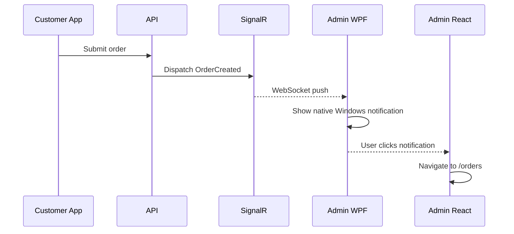
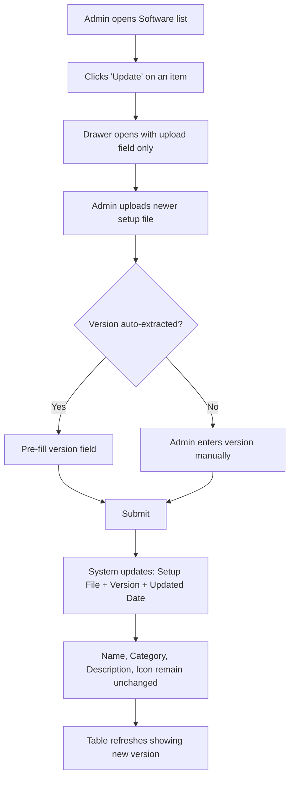
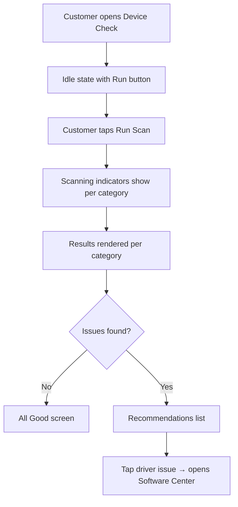
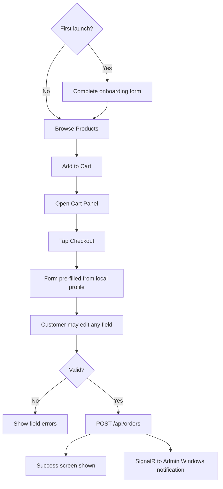

# Smart Device Manager (SDM) - UX & Information Architecture Document
**Version:** 1.0
**Status:** Updated — Dual-Portal Architecture

---

## 1. Portals & Target Users

SDM consists of two portals with distinct user bases and interaction models.

| Portal | Primary Users | Hosting |
| :--- | :--- | :--- |
| **Admin Portal** | IT Administrator, Support Engineer, Operations Manager | WPF + WebView2 |
| **Customer Application** | End customers managing their own devices | WPF + WebView2 |

---

## 2. Admin Portal — Information Architecture

### 2.1 Sidebar Structure

```text
[SDM Admin]
──────────────────────
 Dashboard
──────────────────────
 Operations
  Orders Management
──────────────────────
 Content
  Software Management
  Knowledge Base
──────────────────────
 Monitoring
  Device Monitor
──────────────────────
 Management
  Users
  Company Information
  Settings
──────────────────────
 [Admin Avatar]  [Logout]
```

- Sidebar collapses to 56px icon strip (`Ctrl + \`)
- Collapsed state shows icon + tooltip on hover
- Active route is highlighted with a left accent bar

### 2.2 Header Layout

```text
[ Breadcrumb Track ]  [ Search Ctrl+K ]  [ Order Badge ]  [ Theme Toggle ]  [ Profile ]
```

- **Order Badge:** Shows count of unread/new orders. Driven by SignalR.
- **Search:** Global command search (`Ctrl+K`) for jumping to any page.
- **Profile:** Displays admin name and logout option.

### 2.3 Breadcrumbs

- Format: `Section / Page / Detail`
- Example: `Operations / Orders / Order #1042`
- All ancestor nodes are clickable links
- Dynamic segment labels use human-readable names, never raw IDs

---

## 3. Admin Portal — Page UX Specifications

### 3.1 Login

| Attribute | Detail |
| :--- | :--- |
| **Purpose** | Admin authentication |
| **Route** | `/login` |
| **Layout** | Centered card, AuthLayout |
| **Main Actions** | Submit credentials |
| **Validation** | Inline Zod/React Hook Form validation on blur |
| **Error State** | Toast: "Invalid email or password" |
| **Redirect on success** | `/dashboard` |

---

### 3.2 Dashboard

| Attribute | Detail |
| :--- | :--- |
| **Purpose** | High-level operational overview |
| **Route** | `/dashboard` |
| **Widgets** | Total Orders, New Orders Today, Total Software Items, Total Users |
| **Recent Orders** | Last 5 orders in a compact table with status badges |
| **System Status** | API health indicator, SignalR connection state |
| **Quick Actions** | "View Orders", "Add Software", "Add Article" |
| **Empty State** | "No data yet — the system is ready." |

---

### 3.3 Orders Management

| Attribute | Detail |
| :--- | :--- |
| **Purpose** | Manage incoming customer orders and the product catalog |
| **Route** | `/orders` |
| **View Tabs** | `Incoming Orders` (default) \| `Product Catalog` |
| **Orders Table** | Customer Name, Phone, WhatsApp, Address, Products, Status, Created Date |
| **Order Actions** | View order detail (drawer), Update status |
| **Product Table** | Image, Name, Brand, Price, Status |
| **Product Actions** | Add product (drawer), Edit, Toggle Status |
| **Order Status** | Pending, Processing, Shipped, Completed, Cancelled |
| **Notifications** | New orders arrive via SignalR → native Windows notification |
| **Empty State** | Orders: "No orders yet." Catalog: "Add your first product to the catalog." |

**Order Detail Drawer:**
- Opens from right (400px wide)
- Shows: Customer info, WhatsApp link, Address, Product list with images, Order status dropdown, Timestamps

**Product Drawer:**
- Opens from right (400px wide)
- Shows: Name, Description, Category, Brand, Price, Status toggle, Image upload

---

### 3.4 Software Management

| Attribute | Detail |
| :--- | :--- |
| **Purpose** | Unified management of applications and drivers |
| **Route** | `/software` |
| **Table Columns** | Icon, Name, Category, Version, Upload Date, Updated Date, Actions |
| **Category Values** | Application, Driver |
| **Main Actions** | Add new item (drawer), Edit, Delete, Upload new version |
| **Version Behavior** | Auto-extracted from setup file; editable if extraction fails |
| **Update Behavior** | New setup file replaces old; name, description, icon preserved |
| **No Silent Install** | Admin never configures silent flags or detection rules |
| **Empty State** | "No software uploaded yet. Add applications and drivers to make them available to customers." |

**Add/Edit Drawer:**
- Fields: Name, Category, Version (auto or manual), Description, Icon upload, Setup file upload
- File size limit shown inline
- Version auto-populated on file select; overridable

---

### 3.5 Knowledge Base Management

| Attribute | Detail |
| :--- | :--- |
| **Purpose** | Create and manage troubleshooting articles for customers |
| **Route** | `/knowledge-base` |
| **Table Columns** | Title, Category, Display Order, Visible, Updated Date, Actions |
| **Main Actions** | Add article (drawer), Edit, Delete, Toggle visibility |
| **Empty State** | "No articles yet. Create troubleshooting guides to help customers." |

**Add/Edit Drawer:**
- Fields: Problem Name, Description (rich text), Problem Image (upload), YouTube Video URL, Category, Display Order (number), Visible toggle

---

### 3.6 Device Monitor

| Attribute | Detail |
| :--- | :--- |
| **Purpose** | Monitor hardware status of a target device |
| **Route** | `/devices` |
| **Component** | `DeviceHardwarePanel` (shared with Customer Device Details) |
| **Sections** | CPU, GPU, RAM, Storage, Disk Health, Disk Temperature, Network, Displays, Motherboard, BIOS, Windows, Drivers |
| **Real-time** | Usage metrics refresh automatically |
| **Empty State** | "No device data available. Connect to a device to begin monitoring." |

---

### 3.7 Users

| Attribute | Detail |
| :--- | :--- |
| **Purpose** | Manage administrator accounts |
| **Route** | `/users` |
| **Table Columns** | Name, Email, Role, Created Date, Actions |
| **Main Actions** | Invite user (drawer), Edit role, Revoke access |
| **Roles** | Super Admin, Admin |
| **Empty State** | "No additional users. Invite team members to collaborate." |

---

### 3.8 Company Information

| Attribute | Detail |
| :--- | :--- |
| **Purpose** | Configure the company profile visible to customers |
| **Route** | `/company` |
| **Layout** | Single form (no table) |
| **Fields** | Company Name, Logo, Phone, WhatsApp, Email, Website, Facebook, Address |
| **Behavior** | Auto-saves on submit. Customer app reads this data. |

---

### 3.9 Settings

| Attribute | Detail |
| :--- | :--- |
| **Purpose** | General application preferences |
| **Route** | `/settings` |
| **Sections** | Theme, Notification preferences, API configuration |

---

## 4. Customer Application — Information Architecture

### 4.1 Navigation Structure

The Customer Application uses a **compact left sidebar** — appropriate for a Windows desktop application running inside WPF. It is deliberately simpler and lighter than the Admin sidebar.

```text
[SDM]
───────────────────────
 Dashboard
 Device
 Device Check
 Software Center
 Knowledge Base
 Orders
 Company
───────────────────────
```

The sidebar does not collapse to an icon strip. It remains visible and labeled at all times. This is a fixed, lightweight navigation panel — not a collapsible enterprise sidebar.

### 4.2 Header

```text
[ Page Title ]  [ Optional: search or filter icon ]
```

No breadcrumbs. Minimal top bar.

---

## 5. Customer Application — Page UX Specifications

### 5.1 Onboarding (First Launch Only)

| Attribute | Detail |
| :--- | :--- |
| **Purpose** | Collect basic customer information for order auto-fill. Shown once on first launch. |
| **Route** | `/onboarding` |
| **Layout** | Full-screen centered form. |
| **Fields** | Full Name, Phone Number, WhatsApp (optional), Governorate, Address |
| **Behavior** | Saved to local storage only. Redirects to Dashboard on submit. Never shown again unless reset by user. |
| **NOT authentication** | No username, no password, no server account created. |

---

### 5.2 Dashboard

| Attribute | Detail |
| :--- | :--- |
| **Purpose** | At-a-glance PC health summary |
| **Route** | `/` |
| **Cards** | CPU Usage, GPU Usage, CPU Temp, GPU Temp, RAM Usage, Disk Usage |
| **Status Card** | Overall Device Status (Good / Attention / Critical) |
| **Last Diagnostic** | Date of last Device Check run |
| **Quick Actions** | "Run Device Check", "Open Software Center" |
| **Empty State** | Loading skeleton until hardware data collected |

---

### 5.3 Device Details

| Attribute | Detail |
| :--- | :--- |
| **Purpose** | Full hardware information for the customer's own computer |
| **Route** | `/device` |
| **Component** | `DeviceHardwarePanel` — exact same component as Admin Device Monitor. Visual layout is identical. |
| **Sections** | CPU, GPU, RAM, Storage, Displays, Network, Motherboard, BIOS, Windows, Drivers |
| **Real-time** | Usage metrics refresh live |
| **Empty State** | Skeleton loaders while scanning |

---

### 5.4 Device Check

| Attribute | Detail |
| :--- | :--- |
| **Purpose** | Full system diagnostic scan with results and recommendations |
| **Route** | `/device-check` |
| **Scan Items** | CPU, GPU, RAM, Storage, Disk Health, Windows Activation, Missing Drivers, High Usage flags, Startup Programs |
| **Result Display** | Color-coded results (Green = OK, Amber = Warning, Red = Issue) |
| **Recommendations** | Actionable text under each flagged item |
| **Actions** | "Re-run scan", Direct links to Software Center for missing drivers |
| **Empty State** | "Tap 'Run Scan' to check your device." |

---

### 5.5 Software Center

| Attribute | Detail |
| :--- | :--- |
| **Purpose** | Browse and install/update admin-uploaded software and drivers |
| **Route** | `/software` |
| **Display** | Grid of cards (Icon, Name, Category, Version, Action button) |
| **Item States** | **Install** → run setup; **Update** → run newer setup; **Installed** → no action |
| **Version Logic** | Compares installed version string vs. uploaded version string |
| **No Silent Install** | Customer runs the normal setup UI |
| **Empty State** | "No software available yet. Check back later." |
| **Filter** | Applications / Drivers toggle |

---

### 5.6 Knowledge Base

| Attribute | Detail |
| :--- | :--- |
| **Purpose** | Troubleshooting articles for common problems |
| **Route** | `/knowledge-base` |
| **Display** | Card grid (Title, Category icon, short description) |
| **Article Page** | Problem Image, Full Description, Large YouTube button |
| **YouTube Button** | Opens configured YouTube URL in the system browser |
| **Filter** | By category |
| **Empty State** | "No articles available yet." |

---

### 5.6 Orders

| Attribute | Detail |
| :--- | :--- |
| **Purpose** | Browse products and place orders |
| **Route** | `/orders` |
| **Product Grid** | Product cards (Name, Image, Price, Add to Cart) |
| **Cart** | Slide-out cart panel with item list + Remove controls |
| **Checkout** | Full-screen form: Name, Phone, WhatsApp, Address — all pre-filled from local onboarding profile |
| **Edit before submit** | Customer can change any pre-filled value before confirming |
| **Submission** | POST to API → SignalR event → admin Windows notification |
| **Success State** | "Order placed! We'll contact you soon." |
| **My Orders Tab** | Shows customer's own order history by phone/name lookup |
| **Empty State** | "No products available at the moment." |

---

### 5.8 Company Information

| Attribute | Detail |
| :--- | :--- |
| **Purpose** | Display company contact info set by the admin |
| **Route** | `/company` |
| **Fields Shown** | Phone (tap-to-call), WhatsApp (tap-to-open), Email, Website, Facebook, Address |
| **Empty State** | "Contact information not configured yet." |

---

## 6. Shared UX Patterns (Both Portals)

### 6.1 Loading States

| Scenario | Treatment |
| :--- | :--- |
| Initial page data | Skeleton loaders that match the page grid |
| Button action in progress | Button text replaced with spinner |
| Route transition | Top progress bar (NProgress style) |

### 6.2 Error States

| Error Type | Treatment |
| :--- | :--- |
| API failure | Sonner toast (non-blocking) |
| Network offline | Sticky banner in header/top bar |
| Form validation | Inline red text under each field |
| Page-level crash | Full-page error boundary with reload button |

### 6.3 Empty States

Every empty state includes:
1. A Lucide icon (gray, large)
2. A short title ("No orders yet")
3. A one-line description explaining the expected state
4. An action button where relevant

### 6.4 Success Feedback

- Form submissions → Sonner success toast ("Software added successfully")
- Multi-step flows (e.g. checkout) → Dedicated success screen with next step guidance

### 6.5 Confirmation Dialogs

Required before all destructive actions:
- Delete software entry
- Revoke user access
- Cancel an order

Standard pattern:
- Title: "Are you sure?"
- Body: Specific consequence ("This will permanently delete WinRAR 7.00 and remove it from customer Software Center.")
- Confirm button: Red + destructive label
- Cancel button: Outline

### 6.6 Forms UX

- Labels always above inputs (never floating or inline)
- Validate on blur using Zod via React Hook Form
- Submit button disables and shows spinner during API call
- Success or error feedback rendered within 300ms of response

---

## 7. Navigation Flow Diagrams

### 7.1 Admin — Order Notification Flow



### 7.2 Admin — Software Update Flow



### 7.3 Customer — Device Check Flow



### 7.4 Customer — Order Flow



---

## 8. Shared UI Components

The following components are defined once in `packages/ui` and imported by both portals. Duplication is forbidden.

| Component | Portal Usage | Purpose |
| :--- | :--- | :--- |
| `DeviceHardwarePanel` | Admin: Device Monitor, Customer: Device Details | Full hardware panel. Identical visual layout in both portals. |
| `CpuCard` | Inside DeviceHardwarePanel | CPU metrics and usage block |
| `GpuCard` | Inside DeviceHardwarePanel | GPU metrics and usage block |
| `MemoryCard` | Inside DeviceHardwarePanel | RAM usage block |
| `DiskCard` | Inside DeviceHardwarePanel | Per-disk health and usage block |
| `TemperatureCard` | Inside DeviceHardwarePanel | Temperature readout for CPU/GPU/Disk |
| `NetworkCard` | Inside DeviceHardwarePanel | Network interfaces block |
| `DisplayCard` | Inside DeviceHardwarePanel | Monitor specs block |
| `StorageCard` | Inside DeviceHardwarePanel | Partition usage block |
| `SoftwareCard` | Customer: Software Center | Installable item card (Install / Update / Installed) |
| `CompanyInfoCard` | Customer: Company Information | Company contact display card |

**Identity rule:** Admin Device Monitor and Customer Device Details render the identical `DeviceHardwarePanel` component. Only admin-specific action controls differ. The visual structure and all sub-panels are the same.

---

## 9. Keyboard Shortcuts (Admin Portal)

| Shortcut | Action |
| :--- | :--- |
| `Ctrl + K` | Open global search |
| `Ctrl + \` | Toggle sidebar collapse |
| `Esc` | Close active drawer or dialog |
| `N` then `O` | Navigate to Orders |
| `N` then `S` | Navigate to Software |

---

## 10. Accessibility Rules

| Rule | Implementation |
| :--- | :--- |
| Contrast ratio ≥ 4.5:1 | WCAG 2.1 AA — enforced via design tokens |
| All interactions keyboard-reachable | Tab order matches visual order |
| Focus rings visible | `focus-visible` always on |
| Icon-only buttons labelled | `aria-label` required |
| Dynamic content announced | `aria-live` on order badge and scan results |
| Dialogs focus-trapped | Radix UI / shadcn handles natively |
| Images have alt text | Required on all `` and article images |

---

## 11. Responsive Strategy

### Admin Portal
| Breakpoint | Behavior |
| :--- | :--- |
| `< 1024px` | Sidebar collapses to icon strip automatically |
| `< 768px` | Sidebar becomes a slide-in drawer (hamburger toggle) |
| `≥ 1440px` | Content max-width applied; tables still expand |

### Customer Application
| Breakpoint | Behavior |
| :--- | :--- |
| Default | Compact left sidebar, vertical scroll content |
| `≥ 1280px` | Sidebar slightly wider; content remains card-based |
